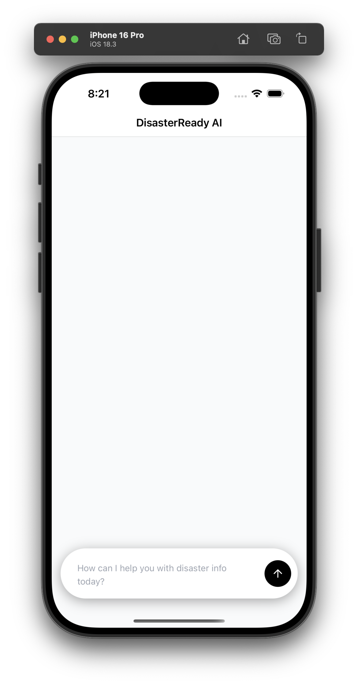

# Disaster Chatbot App 🚀

A mobile chatbot built with **Expo**, **React Native**, and **NativeWind (TailwindCSS for RN)**.  
Navigation is powered by **Expo Router** with a **tab-based layout**.

---

## 📱 Preview



---

## 📦 Tech Stack

- [Expo](https://expo.dev/) – managed React Native framework
- [Expo Router](https://expo.github.io/router/docs) – file-based navigation
- [NativeWind](https://www.nativewind.dev/) – TailwindCSS for React Native
- [TailwindCSS](https://tailwindcss.com/) – utility-first styling
- TypeScript – type safety

---

## ⚙️ Installation

Clone and install dependencies:

```bash
git clone https://github.com/bscs-2026/disaster-chatbot-app.git disaster-chatbot-app
cd disaster-chatbot-app

# install all dependencies
npm install
```

---

## ▶️ Running the App

Start the Expo dev server (always clear Metro’s cache after config changes):

```bash
npx expo start -c
```

- Press **i** → run on iOS Simulator (dl XCode)
- Press **a** → run on Android Emulator (optional)
- Or scan the QR code with **Expo Go** app

---

## 📂 Project Structure

```
disaster-chatbot-app/
├── app/
│   ├── _layout.tsx             # Root stack (entrypoint)
│   └── (tabs)/                 # Tab navigation group
│       ├── _layout.tsx         # Tabs layout
│       ├── index.tsx           # Home screen
│       ├── chat.tsx            # Chatbot UI
│       └── profile.tsx         # User profile
├── components/                 # Reusable UI components
├── assets/                     # Icons, splash, fonts
├── babel.config.js             # Babel config (nativewind plugin required)
├── tailwind.config.js          # Tailwind config
├── package.json                # Fixed entry: "expo-router/entry"
└── README.md
```

---

## 🛠 Common Issues & Fixes

### 1. **Babel error: `Cannot find module 'react-native-worklets/plugin'`**

This happens because the template references a plugin not installed by default.

👉 Fix:

```bash
npm install react-native-worklets --save-dev
npx expo start -c
```

---

### 2. **Header error: `Invalid character in header content ["X-React-Native-Project-Root"]`**

This happens if your project path contains spaces or special characters (e.g., `Desktop - Cassey’s Mac`).

👉 Fix: Move project to a clean path:

```bash
mv "/Users/<you>/Desktop - Cassey’s Mac/disaster-chatbot-app" ~/Projects/disaster-chatbot-app
cd ~/Projects/disaster-chatbot-app
npx expo start -c
```

---

### 3. **Dependency conflicts when installing Expo packages**

Always use **Expo’s installer** instead of plain `npm install` for Expo packages:

```bash
npx expo install expo-router
```

This ensures versions match your Expo SDK.
